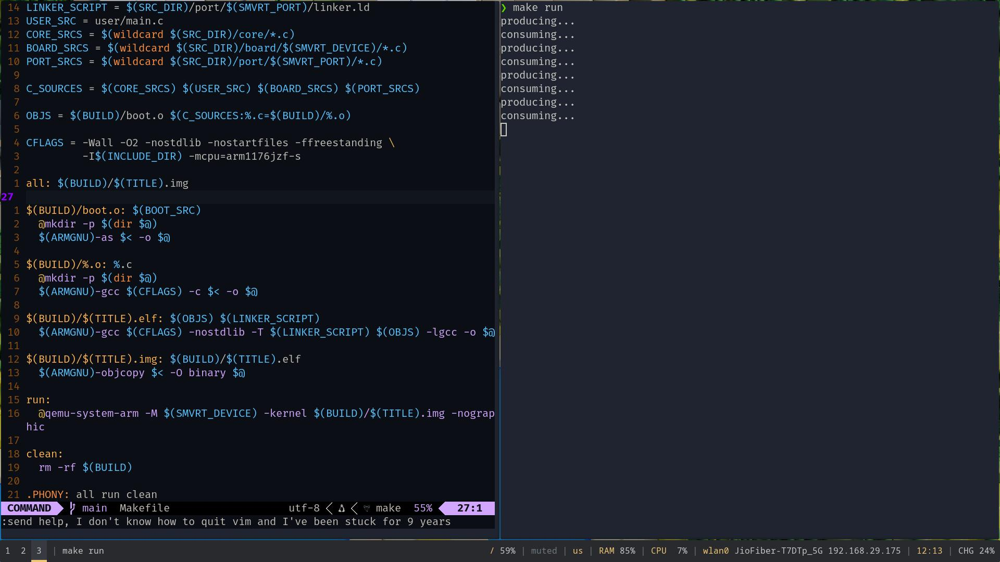

# smvRT - a simple RTOS for old embedded devices
A minimal RTOS for Raspberry Pi written in C and ARM assembly.

Runs tasks with basic context switching. Built for learning and fun.



## Current Features
- Bare-metal kernel that runs on `qemu` (to be tested on hardware)
- Basic cross-platform architecture: [ARCHITECTURE.md](./docs/ARCHITECTURE.md)
- Basic scheduling, context switching

## Build Instructions
```bash
make
```

## User endpoint
For now the user can modify [user/main.c](./user/main.c) to run their code.

Example snippet:
```c
#include "smvrt.h"

int count = 0;

void producer() {
  if (count < 2) {
    smvrt_print("producing...\n");
    for (volatile int i = 0; i < 100000; i++)
      ;
    count++;
  }
}

void consumer() {
  if (count > 0) {
    smvrt_print("consuming...\n");
    for (volatile int i = 0; i < 100000000; i++)
      ;
    count--;
  }
}

void main() {
  smvrt_scheduler_add(producer);
  smvrt_scheduler_add(consumer);
  smvrt_scheduler_run();
}
```

Currently, the [Makefile](/Makefile) doesn't have any customization. This is a TODO.

## ~~How to run (on a real Pi)~~  
1. ~~Copy smvrt.img onto your SD card's boot partition.~~  
2. ~~Boot into your Raspberry Pi.~~  
~~**Note:** Currently, code has only been tested in a hypervisor.~~

## Run on QEMU
```bash
sudo pacman -S qemu-arch-extra # if not installed
make                           # build smvrt.img
make run
```

Currently, the interface is only tested on a hypervisor.

